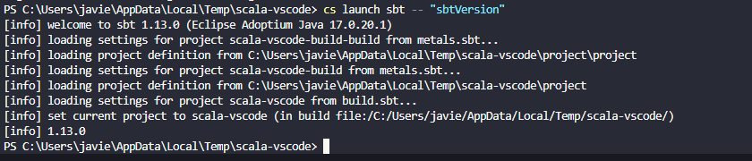
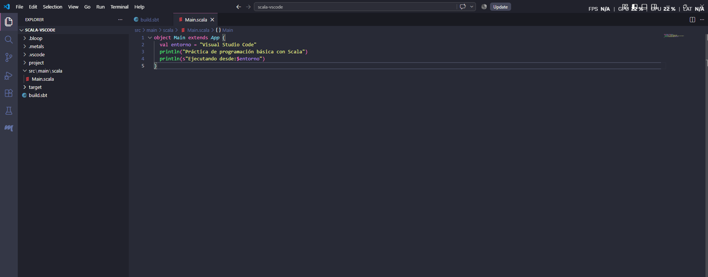
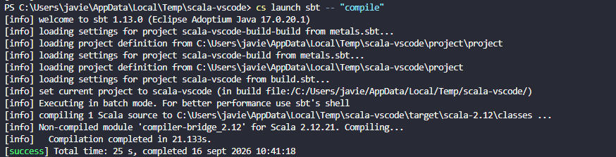
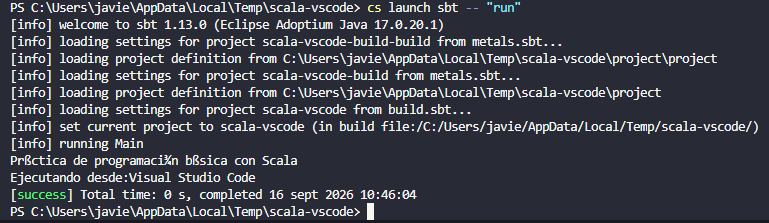

## Configuración e Instalación del Entorno 2: Visual Studio Code y Metals

Para el segundo entorno de desarrollo se seleccionó Visual Studio Code en combinación con el servidor de lenguaje Metals. Esta alternativa ligera permite trabajar con Scala mediante una arquitectura basada en extensiones, manteniendo la gestión de dependencias a través de sbt.

---

## Pasos y Evidencias del Entorno

### 1. Versión de Java
  
Comprobación de la versión de Java activa en el sistema.

### 2. Versión de sbt
  
Verificación de la versión de sbt instalada para la gestión de dependencias.

### 3. Extensión Scala Metals en VS Code
  
Visualización de la extensión de Metals instalada y activa dentro de Visual Studio Code.

### 4. Proyecto Scala
  
Estructura general del proyecto Scala cargado en el editor.

### 5. Compilación con sbt
  
Proceso de compilación de las fuentes del proyecto utilizando sbt.

### 6. Ejecución mediante sbt run
  
Lanzamiento de la aplicación a través de la terminal usando el comando sbt run.

### 7. Ejecución del Proyecto
  
Resultado de la ejecución del programa principal en el entorno.

### 8. Control de Versiones y Compilación Adicional
  
Control de versiones de compilación y verificación final.
