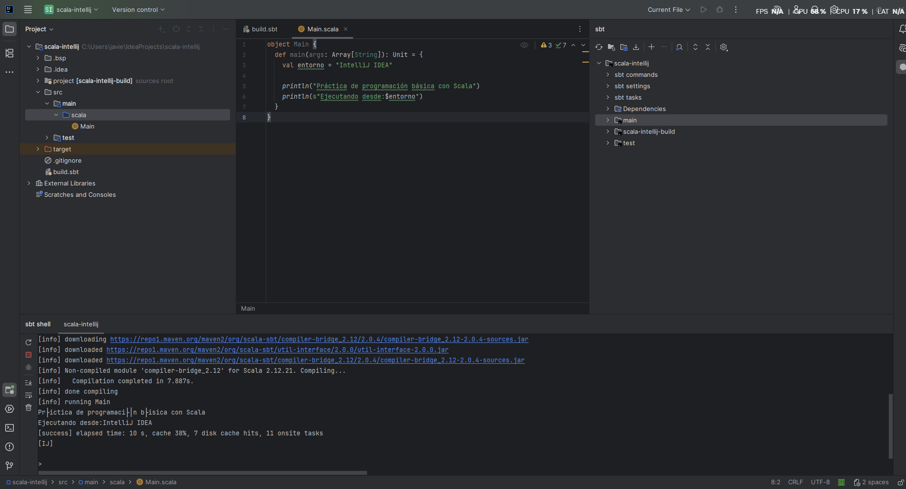

## Entorno 3 — IntelliJ IDEA Community + Scala plugin

### Entorno y Configuración

1. **Instalación de IntelliJ IDEA Community y Plugin de Scala**  
   Se procedió con la instalación de IntelliJ IDEA Community junto con el plugin oficial de Scala para habilitar el soporte del lenguaje.
   
     
   Proceso de instalación y configuración del plugin oficial de Scala en IntelliJ IDEA.

2. **Configuración de JDK 17 y Proyecto sbt**  
   Creación e inicialización del proyecto estructurado con la herramienta de construcción `sbt`, configurado para utilizar Java Development Kit (JDK 17).

### Archivos de Configuración y Código Fuente

3. **Archivo `build.sbt`**  
   Definición del archivo de construcción donde se especifica la versión de Scala (`2.12.21`) y la configuración general del proyecto.

4. **Estructura del Proyecto y Archivo `Main.scala`**  
   Organización de carpetas siguiendo el estándar (`src/main/scala`) con la carpeta `scala` correctamente definida como *Sources Root*, e implementación del objeto `Main`.
   
     
   Vista general de la estructura del proyecto y configuración de directorios en IntelliJ IDEA.

### Ejecución del Programa

5. **Ejecución mediante `sbt shell` (`sbt run`)**  
   Ejecución y compilación directa del proyecto desde la consola interactiva de sbt (`sbt shell`) confirmando la salida por pantalla.
   
     
   Lanzamiento y resultado del programa ejecutado mediante el comando `sbt run` en la consola de sbt.
