# Parte 2 — Programación con Scala

## Entorno utilizado

- JupyterLab
- Almond Kernel
- Scala 2.12.21

## Contenido

Esta parte contiene 15 ejercicios de programación realizados en Scala utilizando JupyterLab, enfocados en colecciones, inmutabilidad, funciones, estructuras de control y efectos secundarios.

## Notebook

[Ver Notebooks de los ejercicios](.)

## Evidencias

### Ejercicio 1
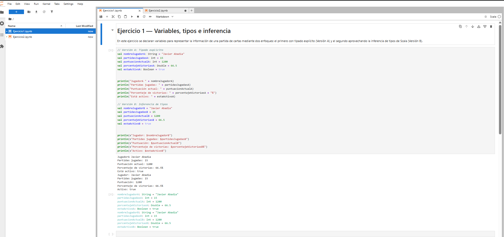

### Ejercicio 2
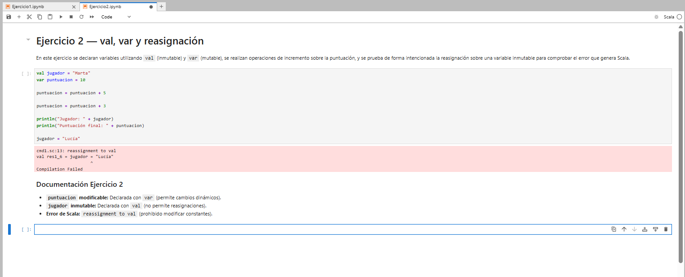

### Ejercicio 3
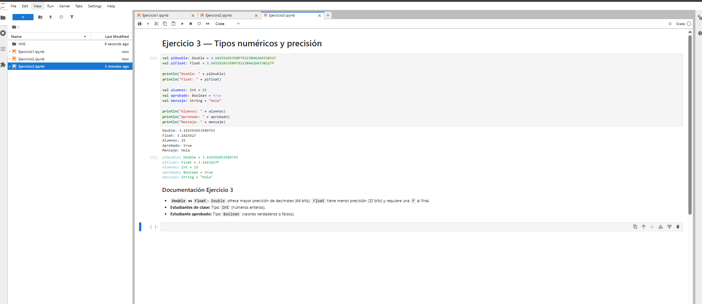

### Ejercicio 4
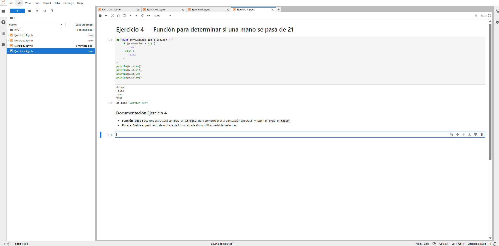

### Ejercicio 5
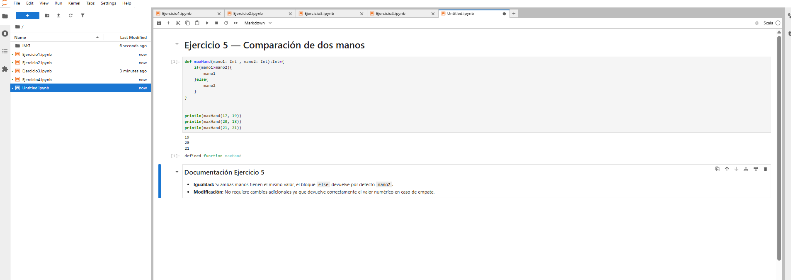

### Ejercicio 6
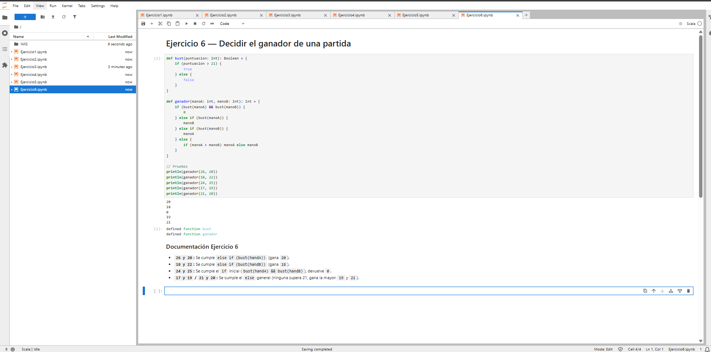

### Ejercicio 7
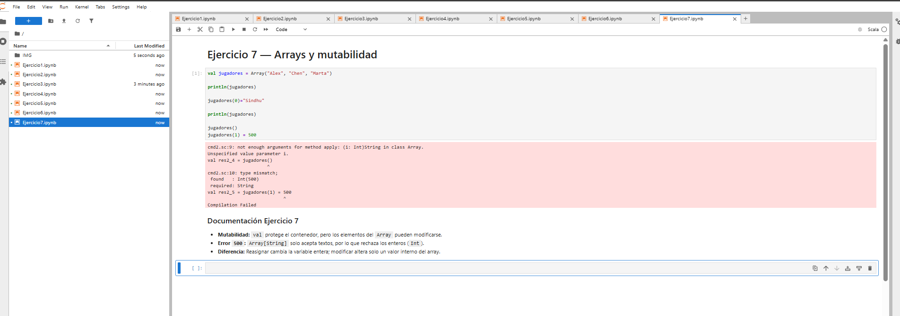

### Ejercicio 8
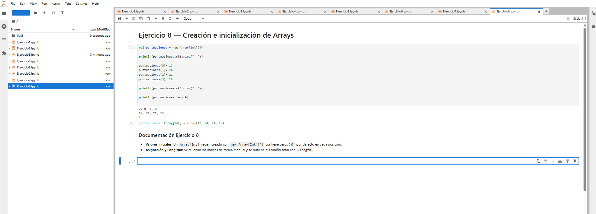

### Ejercicio 9
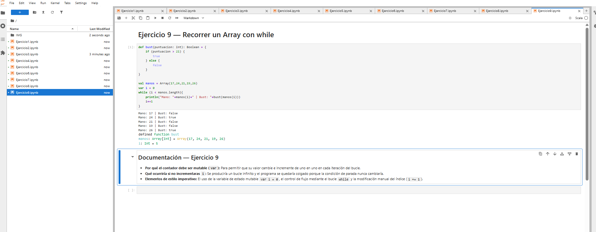

### Ejercicio 10
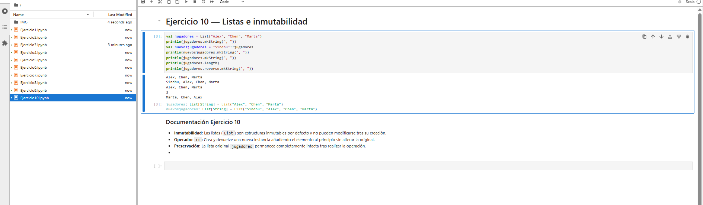

### Ejercicio 11
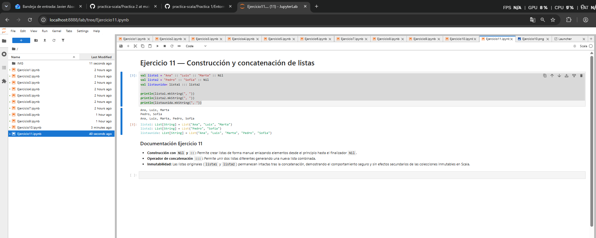

### Ejercicio 12
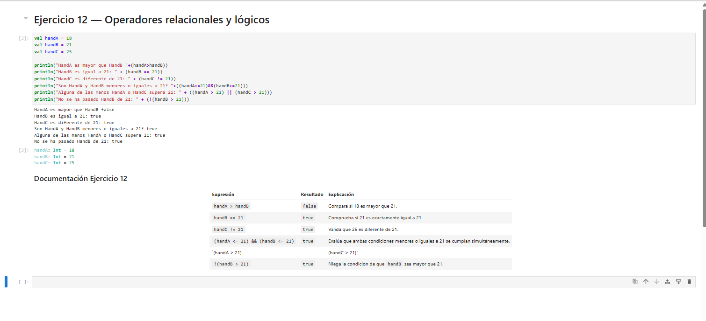

### Ejercicio 13
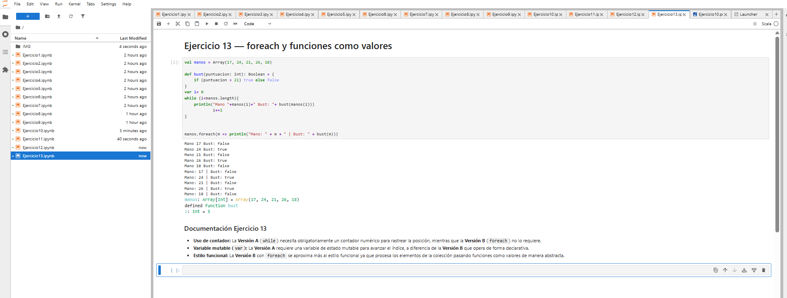

### Ejercicio 14
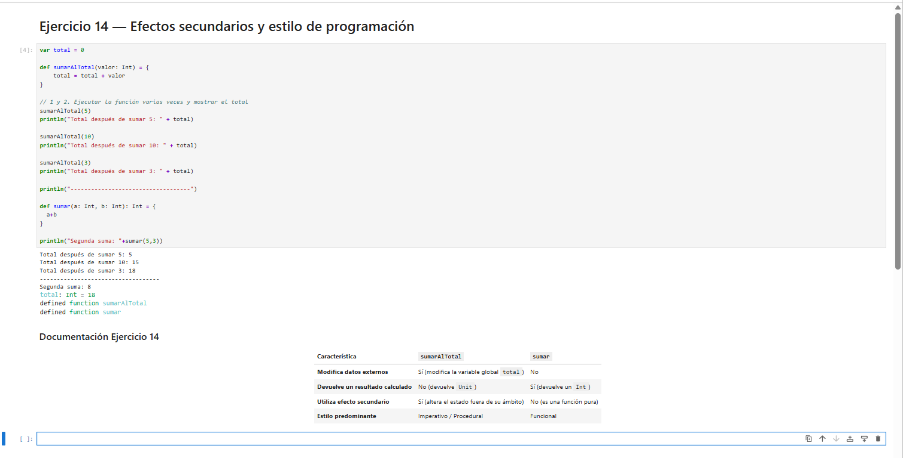

### Ejercicio 15
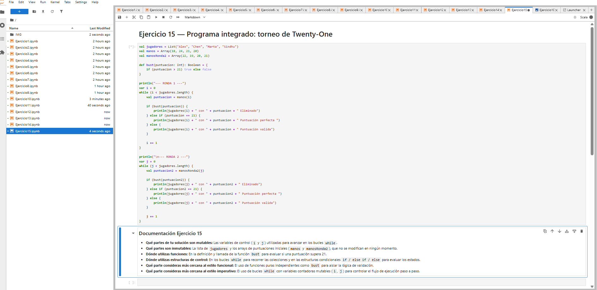